# 🏛️ CipherTradeArena

> **Privacy-Preserving DeFi Strategy Marketplace powered by EigenLayer AVS & Fhenix CoFHE**

CipherTradeArena is a decentralized strategy competition platform where traders submit **fully encrypted DeFi strategies** that compete for capital allocation based on simulated performance. Built on EigenLayer's AVS framework with Fhenix's CoFHE (Confidential Fully Homomorphic Encryption), it ensures complete strategy privacy until execution.

[](https://sepolia.basescan.org/)
[](https://www.eigenlayer.xyz/)
[](https://www.fhenix.io/)

---

## 📋 Table of Contents

- [Overview](#-overview)
- [Architecture](#-architecture)
- [How It Works](#-how-it-works)
- [Deployed Contracts](#-deployed-contracts-base-sepolia)
- [Quick Start](#-quick-start)
- [Operator Setup](#-operator-setup)
- [Trader Guide](#-trader-guide)
- [Technical Details](#-technical-details)

---

## 🎯 Overview

### The Problem
Traditional algo trading competitions reveal strategies before execution, leading to:
- **Front-running** of winning strategies
- **Strategy theft** and copycatting
- **MEV extraction** by observers
- **Limited alpha** for participants

### Our Solution
CipherTradeArena uses **Fully Homomorphic Encryption** (FHE) via Fhenix CoFHE coprocessors to enable:
- ✅ **Blind Strategy Submission** - Traders encrypt strategies client-side using FHE coprocessors
- ✅ **Private Simulation** - AVS operators decrypt and simulate off-chain
- ✅ **Encrypted APY Reporting** - Performance metrics stay confidential
- ✅ **Privacy-Preserving Execution** - Aggregated deployment hides individual strategies

---

## 🏗️ Architecture

### System Components

```
┌─────────────┐      ┌──────────────┐      ┌─────────────┐
│   Traders   │ ───▶ │ TradeManager │ ◀─── │ AVS Operators│
│  (Clients)  │      │  (On-chain)  │      │  (Off-chain) │
└─────────────┘      └──────────────┘      └─────────────┘
     │ Encrypt              │                      │ Decrypt
     │ Strategy             │                      │ Simulate
     │                      │                      │ Report APY
     ▼                      ▼                      ▼
 ┌──────────┐        ┌─────────┐           ┌──────────┐
 │  CoFHE   │        │ Boring  │           │  Events  │
 │Processors│        │  Vault  │           │  Stream  │
 └──────────┘        └─────────┘           └──────────┘
```

### Core Contracts

| Contract | Description | Base Sepolia Address |
|----------|-------------|---------------------|
| **TradeManager** | Main strategy competition contract | [`0x9189AA689Ac1C1ff764FA9b242f6dDcD52D861B2`](https://sepolia.basescan.org/address/0x9189AA689Ac1C1ff764FA9b242f6dDcD52D861B2) |
| **SimpleBoringVault** | Strategy execution vault | [`0x67B492e98AF5bb869dB56d1eAe32D410a7dA0324`](https://sepolia.basescan.org/address/0x67B492e98AF5bb869dB56d1eAe32D410a7dA0324) |
| **ECDSAStakeRegistry** | Operator stake management | [`0x8fC8CFB7f7362E44E472c690A6e025B80E406458`](https://sepolia.basescan.org/address/0x8fC8CFB7f7362E44E472c690A6e025B80E406458) |

---

## 🔄 How It Works

### Phase 1: Epoch Initialization

```mermaid
%%{init: {'theme':'dark', 'themeVariables': { 'primaryColor':'#03dac6', 'primaryTextColor':'#fff', 'primaryBorderColor':'#00a896', 'lineColor':'#03dac6', 'secondaryColor':'#bb86fc', 'tertiaryColor':'#3700b3', 'background':'#121212', 'mainBkg':'#1f1f1f', 'secondBkg':'#2d2d2d', 'labelBackground':'#2d2d2d', 'actorBkg':'#424242', 'actorBorder':'#03dac6', 'actorTextColor':'#fff', 'signalColor':'#03dac6', 'signalTextColor':'#fff'}}}%%
sequenceDiagram
    participant Admin
    participant TradeManager
    participant CoFHE

    rect rgb(30, 60, 80)
        Note over Admin,TradeManager: PHASE 1: Epoch Initialization
        Admin->>CoFHE: Encrypt simulation window
        Note over Admin,CoFHE: Start: 7 days ago<br/>End: 1 day ago
        Admin->>TradeManager: startEpoch(encSimStart, encSimEnd, weights)
        TradeManager-->>Admin: Epoch started
    end
```



### Phase 2: Strategy Submission

```mermaid
%%{init: {'theme':'dark', 'themeVariables': { 'primaryColor':'#4ecdc4', 'primaryTextColor':'#fff', 'primaryBorderColor':'#45b7d1', 'lineColor':'#4ecdc4', 'secondaryColor':'#ff6b6b', 'tertiaryColor':'#3700b3', 'background':'#121212', 'mainBkg':'#1f1f1f', 'secondBkg':'#2d2d2d', 'labelBackground':'#2d2d2d', 'actorBkg':'#424242', 'actorBorder':'#4ecdc4', 'actorTextColor':'#fff', 'signalColor':'#4ecdc4', 'signalTextColor':'#fff'}}}%%
sequenceDiagram
    participant Trader
    participant CoFHE
    participant TradeManager
    participant AVS

    rect rgb(60, 80, 40)
        Note over Trader,TradeManager: PHASE 2: Strategy Submission
        Trader->>CoFHE: Encrypt strategy nodes
        Note over Trader,CoFHE: Encoder, Target,<br/>Selector, Args
        Trader->>TradeManager: submitEncryptedStrategy()
        TradeManager->>AVS: Grant decryption permission
        TradeManager-->>Trader: Strategy submitted
        AVS->>AVS: Listen for StrategySubmitted event
    end
```



### Phase 3: AVS Processing

```mermaid
%%{init: {'theme':'dark', 'themeVariables': { 'primaryColor':'#bb86fc', 'primaryTextColor':'#fff', 'primaryBorderColor':'#9f6bff', 'lineColor':'#bb86fc', 'secondaryColor':'#03dac6', 'tertiaryColor':'#3700b3', 'background':'#121212', 'mainBkg':'#1f1f1f', 'secondBkg':'#2d2d2d', 'labelBackground':'#2d2d2d', 'actorBkg':'#424242', 'actorBorder':'#bb86fc', 'actorTextColor':'#fff', 'signalColor':'#bb86fc', 'signalTextColor':'#fff'}}}%%
sequenceDiagram
    participant AVS
    participant CoFHE
    participant TradeManager

    rect rgb(40, 80, 60)
        Note over AVS,TradeManager: PHASE 3: AVS Processing (Off-chain)
        AVS->>TradeManager: Fetch encrypted strategy
        AVS->>CoFHE: Batch decrypt nodes
        CoFHE-->>AVS: Decrypted values
        AVS->>AVS: Simulate on 100k notional
        AVS->>AVS: Calculate APY
        AVS->>CoFHE: Encrypt APY
        AVS->>TradeManager: reportEncryptedAPY()
    end
```



### Phase 4: Epoch Closure & Finalization

```mermaid
%%{init: {'theme':'dark', 'themeVariables': { 'primaryColor':'#ff6b6b', 'primaryTextColor':'#fff', 'primaryBorderColor':'#ee5a6f', 'lineColor':'#ff6b6b', 'secondaryColor':'#4ecdc4', 'tertiaryColor':'#3700b3', 'background':'#121212', 'mainBkg':'#1f1f1f', 'secondBkg':'#2d2d2d', 'labelBackground':'#2d2d2d', 'actorBkg':'#424242', 'actorBorder':'#ff6b6b', 'actorTextColor':'#fff', 'signalColor':'#ff6b6b', 'signalTextColor':'#fff'}}}%%
sequenceDiagram
    participant Admin
    participant TradeManager
    participant AVS

    rect rgb(60, 40, 80)
        Note over Admin,AVS: PHASE 4: Epoch Closure & Finalization
        Admin->>TradeManager: closeEpoch()
        TradeManager->>TradeManager: Request APY decryption
        AVS->>AVS: Listen for EpochClosed event
        AVS->>AVS: Fetch all APYs
        AVS->>AVS: Rank by APY
        AVS->>AVS: Select top winners
        AVS->>TradeManager: finalizeEpoch(winners, APYs)
        TradeManager-->>Admin: Winners selected
    end
```



### Phase 5: Strategy Execution

```mermaid
%%{init: {'theme':'dark', 'themeVariables': { 'primaryColor':'#ffd93d', 'primaryTextColor':'#000', 'primaryBorderColor':'#f4c430', 'lineColor':'#ffd93d', 'secondaryColor':'#6bcf7f', 'tertiaryColor':'#3700b3', 'background':'#121212', 'mainBkg':'#1f1f1f', 'secondBkg':'#2d2d2d', 'labelBackground':'#2d2d2d', 'actorBkg':'#424242', 'actorBorder':'#ffd93d', 'actorTextColor':'#fff', 'signalColor':'#ffd93d', 'signalTextColor':'#fff'}}}%%
sequenceDiagram
    participant AVS
    participant TradeManager
    participant BoringVault
    participant DeFi

    rect rgb(30, 80, 50)
        Note over AVS,DeFi: PHASE 5: Strategy Execution
        AVS->>AVS: Get winner strategies from events
        AVS->>AVS: Aggregate calls
        AVS->>AVS: Reconstruct calldata
        AVS->>AVS: Sign for consensus
        AVS->>TradeManager: executeEpochTopStrategiesAggregated()
        TradeManager->>BoringVault: Execute aggregated strategy
        BoringVault->>DeFi: Deploy capital
    end
```



---

## 📜 Deployed Contracts (Base Sepolia)

### Core Contracts

| Contract | Description | Address | Explorer |
|----------|-------------|---------|----------|
| **TradeManager** | Strategy competition & AVS coordination | `0x9189AA689Ac1C1ff764FA9b242f6dDcD52D861B2` | [View](https://sepolia.basescan.org/address/0x9189AA689Ac1C1ff764FA9b242f6dDcD52D861B2) |
| **SimpleBoringVault** | Capital deployment vault | `0x67B492e98AF5bb869dB56d1eAe32D410a7dA0324` | [View](https://sepolia.basescan.org/address/0x67B492e98AF5bb869dB56d1eAe32D410a7dA0324) |
| **ECDSAStakeRegistry** | Operator registration | `0x8fC8CFB7f7362E44E472c690A6e025B80E406458` | [View](https://sepolia.basescan.org/address/0x8fC8CFB7f7362E44E472c690A6e025B80E406458) |

### Mock Tokens (Testnet)

| Token | Symbol | Address | Explorer |
|-------|--------|---------|----------|
| **Mock USDC** | USDC | `0x9c14aC9E88Eb84Fc341291FBf06B891592E3bcC7` | [View](https://sepolia.basescan.org/address/0x9c14aC9E88Eb84Fc341291FBf06B891592E3bcC7) |
| **Mock USDT** | USDT | `0x0f1333EaFF107C4d205d2d80b567D003d7870ad5` | [View](https://sepolia.basescan.org/address/0x0f1333EaFF107C4d205d2d80b567D003d7870ad5) |
| **PT eUSDE** | PT-eUSDE | `0xFF9F206B333C902Af93426f7b6630F103cB85309` | [View](https://sepolia.basescan.org/address/0xFF9F206B333C902Af93426f7b6630F103cB85309) |
| **PT sUSDE** | PT-sUSDE | `0x4cabe68B3C6d65F7f12cDDa41998257b6E16DF16` | [View](https://sepolia.basescan.org/address/0x4cabe68B3C6d65F7f12cDDa41998257b6E16DF16) |
| **PT USR** | PT-USR | `0xfB8C7bE6BAfB392BF2386EBD616916f08e2d5E1f` | [View](https://sepolia.basescan.org/address/0xfB8C7bE6BAfB392BF2386EBD616916f08e2d5E1f) |

### Mock DeFi Protocols (Testnet)

| Protocol | Address | Explorer |
|----------|---------|----------|
| **Mock Pendle** | `0x81095fCdb1502B986a6A3ce33323412d45167364` | [View](https://sepolia.basescan.org/address/0x81095fCdb1502B986a6A3ce33323412d45167364) |
| **Mock Aave** | `0x7cAC40567e1891902eeafE3fD10FfC3ED4043252` | [View](https://sepolia.basescan.org/address/0x7cAC40567e1891902eeafE3fD10FfC3ED4043252) |
| **Mock Morpho** | `0x909D68D8A57Ab8F62B6391e117a77B215Ab21Dfc` | [View](https://sepolia.basescan.org/address/0x909D68D8A57Ab8F62B6391e117a77B215Ab21Dfc) |

---

## 🚀 Quick Start

### Prerequisites
```bash
# Node.js & npm
node --version  # v18+
npm --version

# Foundry (for contracts)
forge --version

# Git
git clone https://github.com/your-org/CipherTradeArena
cd CipherTradeArena/hello-world-avs
```

### Install Dependencies
```bash
# Install operator dependencies
npm install

# Install contract dependencies
cd contracts
forge install
cd ..
```

### Environment Setup
```bash
# Copy environment template
cp .env.example .env

# Edit .env with your values
# PRIVATE_KEY=your_private_key_here
# RPC_URL=https://rpc.ankr.com/base_sepolia/YOUR_KEY
```

---

## 🤖 Operator Setup

### 1. Register as Operator
```bash
# Start operator (auto-registers on first run)
ts-node operator/index.ts
```

**What happens:**
- Registers with EigenLayer DelegationManager
- Registers with ECDSAStakeRegistry
- Registers with TradeManager
- Starts monitoring for StrategySubmitted events

### 2. Operator Workflow

```
┌──────────────────────────────────────────────┐
│  Operator Lifecycle                          │
├──────────────────────────────────────────────┤
│                                              │
│  1. Start operator                           │
│     ts-node operator/index.ts                │
│                                              │
│  2. Process strategies (automatic)           │
│     - Decrypt encrypted strategies           │
│     - Simulate on historical data            │
│     - Calculate APY                          │
│     - Report encrypted APY to chain          │
│                                              │
│  3. Close & Finalize epoch (manual)          │
│     ts-node operator/closeAndFinalizeEpoch.ts 1 │
│     - Closes epoch after deadline            │
│     - Reads APYs from events                 │
│     - Ranks strategies                       │
│     - Submits winners to chain               │
│                                              │
│  4. Execute strategies (manual)              │
│     ts-node operator/executeAggregatedStrategies.ts 1 │
│     - Aggregates winner strategies           │
│     - Reconstructs calldata                  │
│     - Executes via BoringVault               │
│                                              │
└──────────────────────────────────────────────┘
```

---

## 👤 Trader Guide

### 1. Start an Epoch (Admin Only)
```bash
ts-node operator/setupAndStartEpoch.ts
```

### 2. Submit Encrypted Strategy
```bash
ts-node operator/createEncryptedStrategyInputs.ts
```

**Example Strategy (2 nodes):**
```typescript
// Node 1: Supply 1000 USDC to Aave
{
  target: AavePool,
  function: "supply",
  args: [USDC, 1000e6, trader, 0]
}

// Node 2: Borrow 500 USDT from Aave
{
  target: AavePool,
  function: "borrow",
  args: [USDT, 500e6, 2, 0, trader]
}
```

### 3. Wait for Results

After epoch ends:
- Operators simulate your strategy
- APY is calculated and reported (encrypted)
- You can view your own APY: `tradeManager.viewMyAPY(epochNumber)`

### 4. Winners Announced

Top strategies by APY receive capital allocation:
- **1st Place**: 50% of capital
- **2nd Place**: 30% of capital
- **3rd Place**: 20% of capital

---

## 🔧 Technical Details

### Encryption Types (Fhenix CoFHE)

| Type | Usage | Example |
|------|-------|---------|
| `euint160` (Address) | Contract addresses | Aave Pool, USDC token |
| `euint32` | Function selectors | `0x617ba037` (supply) |
| `euint128` | Token amounts | 1000000000 (1000 USDC) |
| `euint16` | APY values | 1234 (12.34%) |
| `euint8` | Small values | Referral codes, modes |

### Strategy Node Structure

```solidity
struct StrategyNode {
    eaddress encoder;      // Sanitizer/decoder contract
    eaddress target;       // DeFi protocol address
    euint32 selector;      // Function selector
    HandleWithType[] args; // Dynamic encrypted arguments
}
```

### APY Calculation

```typescript
// Simulation on 100k notional
initialCapital = 100,000 USDC
finalValue = simulateStrategy(strategy, historicalData)
yearlyYield = (finalValue - initialCapital) * (365 / simulationDays)
apyBps = (yearlyYield / initialCapital) * 10000
```

**Example:**
- Initial: $100,000
- Final: $100,500
- Daily yield: $500
- Yearly: $182,500
- APY: 182.5% (18250 bps)

### Supported Protocols (Testnet)

- **Aave V3**: Lending & borrowing
- **Pendle**: Yield trading
- **Morpho**: Optimized lending
- **Mock Protocols**: For testing

### Privacy Guarantees

1. **Strategy Privacy**: Encrypted until operator decryption grant
2. **APY Privacy**: Encrypted for individual traders, only finalized winners revealed
3. **Execution Privacy**: Aggregated calls hide individual contributions
4. **Simulation Window Privacy**: Encrypted to prevent overfitting

---

## 📂 Repository Structure

```
├── contracts/              # Solidity contracts
│   ├── src/
│   │   ├── TradeManager.sol        # Main AVS contract
│   │   ├── SimpleBoringVault.sol   # Execution vault
│   │   └── interfaces/             # Contract interfaces
│   ├── script/                     # Deployment scripts
│   └── test/                       # Contract tests
│
├── operator/                       # AVS operator code
│   ├── index.ts                    # Main operator loop
│   ├── closeAndFinalizeEpoch.ts   # Epoch finalization
│   ├── executeAggregatedStrategies.ts  # Strategy execution
│   ├── cofheUtils.ts               # CoFHE encryption/decryption
│   └── utils/
│       ├── strategySimulator.ts    # APY calculation
│       └── protocolMapping.ts      # DeFi protocol configs
│
├── abis/                   # Contract ABIs
└── README.md              # This file
```

---

## 🧪 Testing

### Run Contract Tests
```bash
cd contracts
forge test -vv
```

### Test Operator Flow
```bash
# 1. Start epoch
ts-node operator/setupAndStartEpoch.ts

# 2. Submit strategy
ts-node operator/createEncryptedStrategyInputs.ts

# 3. Start operator (processes automatically)
ts-node operator/index.ts

# 4. Wait for epoch to end, then finalize
ts-node operator/closeAndFinalizeEpoch.ts 1

# 5. Execute winners
ts-node operator/executeAggregatedStrategies.ts 1
```

---

## 🛡️ Security Considerations

### Operator Trust Model
- Operators see decrypted strategies during simulation
- Requires honest majority for consensus
- Strategies are aggregated before execution to preserve privacy

### FHE Limitations
- Cannot encrypt negative numbers (APYs clamped to 0)
- Computational overhead for complex operations
- Gas costs for FHE operations

### Known Issues
- Testnet only (Base Sepolia)
- Limited protocol support
- No slashing implemented yet

---

## 📝 License

MIT License - See [LICENSE](./LICENSE)

---

## 🙏 Acknowledgments

- **EigenLayer**: AVS infrastructure
- **Fhenix**: Fully homomorphic encryption via CoFHE coprocessors (on-chain and off-chain)
- **Base**: L2 deployment platform

---

**Built with ❤️ for the future of private DeFi**
